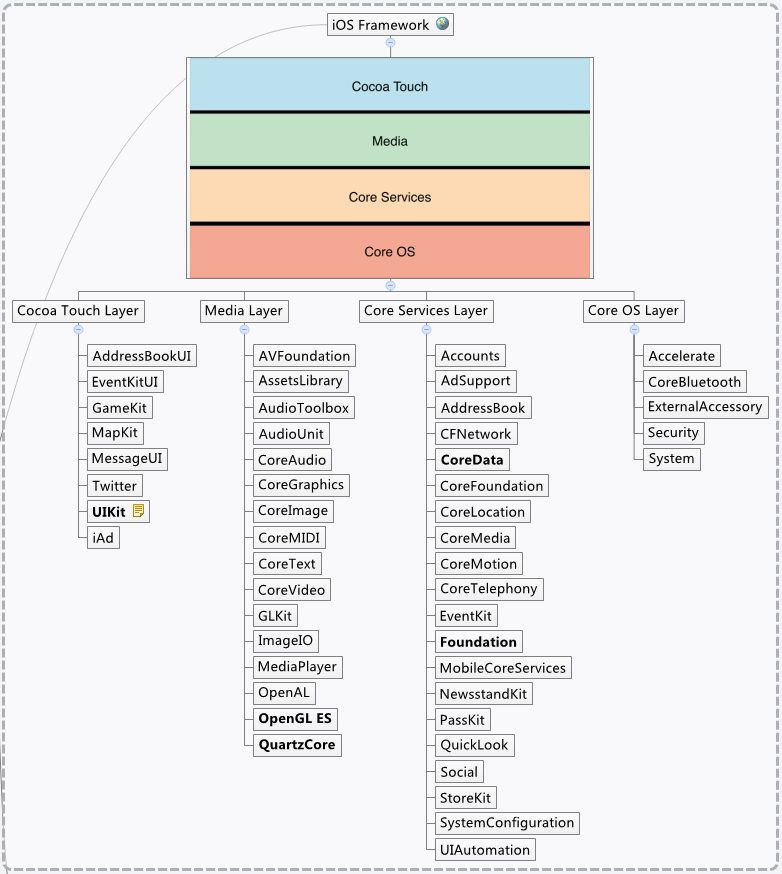

# iOS 开源项目收藏、整理

github上的项目众多，值得收藏的项目不胜枚举，适当的分类和整理有利于弥补watch和star的不足，并能够方便的在多机、朋友间分享。


## 目录命名规则

[](https://developer.apple.com/library/ios/navigation/)

*   一级目录：依据 framework，参考上图
*   二级目录：
    *   ui：
	    *   ext.xxx：对iOS已有class的**扩展**，即：**实现手段**或**实现类**
	    *   req.yyy：根据**需求**命名，即：用途、目标等
    *   foundation：

## git submodule 操作

参考： [git submodule 操作](http://wkevin.github.io/2014/05/05/git-submodule/)

### 【推荐操作】
发布者：
```
$ git submodule add -b master https://......
$ git commit
```
使用者：
```
$ git clone https://github.com/wkevin/iOS.grocery.git
$ cd iOS.grocery
$ git submodule init
$ git submodule update --remote
$ git submodule foreach --recursive git fetch origin
```


